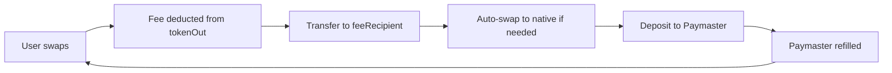

# ZeroToll Gasless Swap Specification v1.0
**Date:** November 9, 2025  
**Status:** Draft for Review  
**Target Networks:** Polygon zkEVM Amoy (testnet), Ethereum Sepolia (testnet)

---

## 🎯 Executive Summary

Enable **gasless swaps** on ZeroToll where users can swap tokens WITHOUT needing native gas (ETH/MATIC/POL). Gas costs are **sponsored by a Paymaster** and **recovered via fee-on-output** (deducted from swap proceeds).

### Key Benefits
- ✅ **Zero friction onboarding:** Users don't need native tokens to start trading
- ✅ **MetaMask compatible:** Works with MetaMask Smart Account mode (EIP-7702)
- ✅ **Self-sovereign:** Self-hosted paymaster (not dependent on centralized providers)
- ✅ **Economically sustainable:** Fee collection covers gas costs + margin

---

## 🏗️ Architecture Overview

### High-Level Flow

```
┌─────────────────────────────────────────────────────────────┐
│ USER (MetaMask EOA + Smart Account Delegator)              │
│ - Has USDC/WMATIC but NO native gas                        │
└──────────────────┬──────────────────────────────────────────┘
                   │
                   │ 1. Creates Intent (tokenIn→tokenOut)
                   │ 2. Signs UserOperation (ERC-4337)
                   ▼
┌─────────────────────────────────────────────────────────────┐
│ FRONTEND (ZeroToll dApp)                                    │
│ - Detects MetaMask Smart Account capability                 │
│ - Builds UserOperation (batched: approve + swap)            │
│ - Sends to Bundler API                                      │
└──────────────────┬──────────────────────────────────────────┘
                   │
                   │ 3. Submit UserOp
                   ▼
┌─────────────────────────────────────────────────────────────┐
│ BUNDLER (Stackup / Self-hosted)                             │
│ - Validates UserOp                                          │
│ - Requests sponsorship from Paymaster                       │
└──────────────────┬──────────────────────────────────────────┘
                   │
                   │ 4. Validate & sign sponsorship
                   ▼
┌─────────────────────────────────────────────────────────────┐
│ PAYMASTER (VerifyingPaymaster - Self-hosted)                │
│ Policy Server:                                              │
│ - Check: target = RouterHub.executeRoute                    │
│ - Check: token whitelist (USDC, WMATIC, WETH)              │
│ - Check: user rate limit (max 10 swaps/day)                │
│ - Estimate gas cost → verify fee will cover                 │
│ - Sign approval                                             │
└──────────────────┬──────────────────────────────────────────┘
                   │
                   │ 5. Bundle + submit on-chain
                   ▼
┌─────────────────────────────────────────────────────────────┐
│ ENTRYPOINT (ERC-4337 - 0x5FF...002 on all chains)          │
│ - Validate signatures                                       │
│ - Execute UserOp.callData                                   │
│ - Paymaster pays gas                                        │
└──────────────────┬──────────────────────────────────────────┘
                   │
                   │ 6. Execute swap
                   ▼
┌─────────────────────────────────────────────────────────────┐
│ ROUTERHUB v1.4 (ZeroToll)                                   │
│ - Pull tokenIn from user                                    │
│ - Prefund adapter                                           │
│ - Execute swap via adapter                                  │
│ - Calculate fee: fee = grossOut * feeBps / 10000           │
│ - Transfer fee → feeRecipient (Paymaster treasury)          │
│ - Transfer netOut → user                                    │
│ - Emit: RouteExecuted(grossOut, fee, netOut)               │
└──────────────────┬──────────────────────────────────────────┘
                   │
                   │ 7. Adapter returns tokenOut to RouterHub
                   ▼
┌─────────────────────────────────────────────────────────────┐
│ MOCKDEXADAPTER (Amoy) / Real DEX Adapter (Production)      │
│ - Swap tokenIn → tokenOut using oracle/DEX                  │
│ - Return amountOut to RouterHub                             │
└─────────────────────────────────────────────────────────────┘
```

---

## 💰 Fee Model & Economics

### Fee-on-Output Formula

```solidity
// After adapter returns grossOut
uint256 fee = (grossOut * feeBps) / 10000;
uint256 netOut = grossOut - fee;

// Constraints
require(netOut >= intent.minOut, "Slippage + fee not covered");
require(fee >= estimatedGasCost * 1.2, "Fee too low for break-even");
```

### Default Parameters

| Parameter | Value | Rationale |
|-----------|-------|-----------|
| `feeBps` | 50 (0.5%) | Industry standard swap fee |
| `minFee` | $0.10 equivalent | Cover minimum gas cost (~100k gas @ $0.001/gas) |
| `maxFee` | $5.00 equivalent | Prevent exploits on large swaps |
| `feeRecipient` | Paymaster Treasury | Auto-accumulates to refill paymaster deposit |

### Break-Even Analysis

**Assumptions:**
- Gas per swap: ~150,000 gas (approve + executeRoute + adapter)
- Gas price (Amoy): ~30 gwei
- POL price: $0.18
- USDC price: $1.00

**Cost per swap:**
```
Gas cost = 150,000 gas * 30 gwei * $0.18 = $0.00081
With 20% margin: $0.00097
```

**Fee collected (0.5% on $100 swap):**
```
Swap: 100 USDC → 566 WMATIC
Fee: 566 * 0.005 = 2.83 WMATIC = $0.51
Profit: $0.51 - $0.001 = $0.509 per swap ✅
```

**Break-even point:** ~$0.20 swap size
- Below $0.20: Use higher feeBps (1-2%)
- Above $0.20: Sustainable at 0.5%

### Fee Accumulation & Refill



**Auto-refill trigger:**
- Monitor paymaster balance every 100 swaps
- If balance < 0.5 ETH/MATIC → trigger refill
- Swap accumulated fees → native → `paymaster.deposit()`

---

## 🔐 Security & Risk Management

### Rate Limiting (Policy Server)

| Limit Type | Value | Enforcement |
|------------|-------|-------------|
| Per-wallet daily | 10 swaps | Off-chain (policy server) |
| Per-wallet amount | $1,000/day | Off-chain (policy server) |
| Global daily | 1,000 swaps | On-chain (circuit breaker) |
| Min swap size | $1 | On-chain (RouterHub check) |

### Whitelist Controls

**Tokens (initially):**
- Amoy: WMATIC, USDC, LINK
- Sepolia: WETH, USDC, LINK

**Adapters:**
- Only whitelisted adapters allowed in RouterHub
- Adapter must return funds to RouterHub (not directly to user)

**Functions:**
- Paymaster only sponsors `RouterHub.executeRoute()`
- Reject any other function calls

### Failure Modes & Fallbacks

| Scenario | Response | Fallback |
|----------|----------|----------|
| Paymaster down | Reject UserOp gracefully | User pays gas (EOA mode) |
| Policy server down | Reject all sponsorships | User pays gas |
| Fee too low | Reject off-chain | Show error: "Swap too small for gasless" |
| Adapter reverts | UserOp reverts (gas refunded by paymaster) | User tries again |
| Slippage exceeded | Tx reverts (gas covered by paymaster) | User adjusts slippage |

---

## 🛠️ Implementation Plan

### Phase 1: Smart Contract Modifications (Est. 2-3 hours)

**RouterHub.sol changes (MINIMAL):**
```solidity
// ADD: Fee configuration
uint16 public feeBps = 50; // 0.5%
uint16 public minFeeBps = 10; // 0.1% minimum
uint16 public maxFeeBps = 200; // 2% maximum
address public feeRecipient;

function setFeeConfig(uint16 _feeBps, address _feeRecipient) external onlyOwner {
    require(_feeBps >= minFeeBps && _feeBps <= maxFeeBps, "Invalid fee");
    feeBps = _feeBps;
    feeRecipient = _feeRecipient;
}

// MODIFY: executeRoute (after adapter returns grossOut)
// Before:
// IERC20(tokenOut).safeTransfer(intent.user, grossOut);

// After:
uint256 fee = 0;
if (feeRecipient != address(0) && feeBps > 0) {
    fee = (grossOut * feeBps) / 10000;
    require(grossOut >= intent.minOut + fee, "Slippage + fee not covered");
    if (fee > 0) {
        IERC20(tokenOut).safeTransfer(feeRecipient, fee);
    }
}
uint256 netOut = grossOut - fee;
IERC20(tokenOut).safeTransfer(intent.user, netOut);

emit RouteExecuted(
    IntentLib.hashIntent(intent),
    grossOut,
    intent.dstChainId,
    false,
    grossOut,
    netOut
);
emit FeeCharged(intent.user, tokenOut, fee, feeBps); // NEW EVENT
```

**NO breaking changes:**
- ✅ Existing function signature unchanged
- ✅ If `feeRecipient == address(0)`, fee = 0 (backward compatible)
- ✅ No need to deploy new RouterHub (just upgrade existing)

### Phase 2: Paymaster Deployment (Est. 1-2 hours)

**Contract:** VerifyingPaymaster (Infinitism reference)
```solidity
contract VerifyingPaymaster is BasePaymaster {
    address public verifyingSigner; // Backend wallet
    
    function validatePaymasterUserOp(
        UserOperation calldata userOp,
        bytes32 userOpHash,
        uint256 maxCost
    ) external override returns (bytes memory context, uint256 validationData) {
        // 1. Decode paymasterAndData
        (address signer, bytes memory signature) = abi.decode(
            userOp.paymasterAndData[20:], 
            (address, bytes)
        );
        
        // 2. Verify signature from policy server
        bytes32 hash = ECDSA.toEthSignedMessageHash(userOpHash);
        address recovered = ECDSA.recover(hash, signature);
        require(recovered == verifyingSigner, "Invalid signature");
        
        // 3. Return approval
        return ("", 0);
    }
}
```

**Deployment steps:**
1. Deploy VerifyingPaymaster to Amoy
2. Deploy VerifyingPaymaster to Sepolia
3. Set verifyingSigner = backend wallet address
4. Deposit 0.5 ETH/MATIC initial funds
5. Set RouterHub.feeRecipient = Paymaster treasury wallet

### Phase 3: Backend Policy Server (Est. 3-4 hours)

**Express.js API:**
```typescript
// POST /api/paymaster/sponsor
app.post('/paymaster/sponsor', async (req, res) => {
    const { userOp, chainId } = req.body;
    
    // 1. Decode callData
    const decoded = routerHub.interface.decodeFunctionData('executeRoute', userOp.callData);
    const intent = decoded[0];
    
    // 2. Validate
    if (!isTokenWhitelisted(intent.tokenIn, chainId)) {
        return res.status(403).json({ error: 'Token not whitelisted' });
    }
    
    if (!checkRateLimit(userOp.sender)) {
        return res.status(429).json({ error: 'Rate limit exceeded' });
    }
    
    // 3. Estimate gas cost
    const gasEstimate = 150000; // Conservative
    const gasPrice = await provider.getGasPrice();
    const gasCost = gasEstimate * gasPrice;
    
    // 4. Verify fee will cover
    const expectedFee = calculateFee(intent, feeBps);
    if (expectedFee < gasCost * 1.2) {
        return res.status(400).json({ error: 'Swap too small for gasless' });
    }
    
    // 5. Sign sponsorship
    const userOpHash = getUserOpHash(userOp, chainId);
    const signature = await backendWallet.signMessage(ethers.getBytes(userOpHash));
    
    res.json({
        paymasterAndData: ethers.concat([
            paymasterAddress,
            ethers.AbiCoder.defaultAbiCoder().encode(
                ['address', 'bytes'],
                [backendWallet.address, signature]
            )
        ])
    });
});
```

### Phase 4: Frontend Integration (Est. 4-5 hours)

**Key changes:**
```typescript
// 1. Detect Smart Account capability
const hasSmartAccount = await detectMetaMaskSmartAccount();

// 2. Build UserOperation (if gasless available)
if (hasSmartAccount && paymasterAvailable) {
    const userOp = {
        sender: smartAccountAddress,
        nonce: await getNonce(),
        callData: encodeFunctionData({
            abi: routerHubAbi,
            functionName: 'executeRoute',
            args: [intent, adapter, routeData]
        }),
        paymasterAndData: '0x', // Will be filled by policy server
        // ... other fields
    };
    
    // 3. Request sponsorship
    const sponsorship = await fetch('/api/paymaster/sponsor', {
        method: 'POST',
        body: JSON.stringify({ userOp, chainId })
    }).then(r => r.json());
    
    userOp.paymasterAndData = sponsorship.paymasterAndData;
    
    // 4. Submit to bundler
    const userOpHash = await bundlerClient.sendUserOperation(userOp);
    
    // 5. Wait for receipt
    const receipt = await bundlerClient.waitForUserOperationReceipt(userOpHash);
}
```

**UI/UX:**
- Show "⚡ Gasless" badge when available
- Display fee deduction in quote: "You receive: X USDC (after 0.5% fee)"
- Fallback to regular approval + swap if paymaster unavailable

---

## 📊 Testing Matrix

### Unit Tests (Hardhat)

| Test Case | Input | Expected Output |
|-----------|-------|-----------------|
| Fee calculation | 100 USDC gross, 0.5% fee | 0.5 USDC fee, 99.5 USDC net |
| Fee disabled | feeRecipient = 0x0 | 0 fee, 100% to user |
| Min slippage | grossOut = 100, minOut = 101, fee = 1 | Revert "Slippage + fee not covered" |
| Zero fee mode | feeBps = 0 | 0 fee (backward compat) |

### Integration Tests (Testnet)

| Network | Pair | Size | Expected Fee | Expected Gas |
|---------|------|------|--------------|--------------|
| Amoy | WMATIC → USDC | 1 WMATIC | ~0.01 USDC | ~150k gas |
| Amoy | USDC → WMATIC | 10 USDC | ~0.05 USDC | ~150k gas |
| Sepolia | WETH → USDC | 0.01 WETH | ~0.15 USDC | ~150k gas |

### Stress Tests

- 100 consecutive swaps (check paymaster balance depletion)
- Concurrent swaps from 10 wallets (rate limit test)
- Adversarial: Try to exploit with very small swaps (<$0.10)

---

## 📈 Success Metrics

### Technical Metrics
- ✅ Gasless swap success rate > 95%
- ✅ Average confirmation time < 30 seconds
- ✅ Fee collection covers gas cost + 20% margin
- ✅ Paymaster uptime > 99%

### Business Metrics
- ✅ 50% of users choose gasless option (when available)
- ✅ Average swap size > $10 (profitable)
- ✅ Zero user complaints about "hidden fees" (transparency)

---

## 🚀 Deployment Checklist

### Pre-deployment
- [ ] RouterHub fee logic tested on local fork
- [ ] VerifyingPaymaster deployed to Amoy testnet
- [ ] VerifyingPaymaster deployed to Sepolia testnet
- [ ] Policy server running and responding
- [ ] Bundler endpoint configured
- [ ] Backend wallet funded (for signing)
- [ ] Paymaster contracts funded (0.5 ETH/MATIC each)

### Deployment Day
- [ ] Set RouterHub.feeRecipient to paymaster treasury
- [ ] Set RouterHub.feeBps to 50 (0.5%)
- [ ] Verify adapter whitelist current
- [ ] Deploy frontend with gasless detection
- [ ] Monitor first 10 swaps manually
- [ ] Check fee collection working

### Post-deployment
- [ ] Monitor paymaster balance daily
- [ ] Review rate limit logs weekly
- [ ] Adjust feeBps if break-even not met
- [ ] Plan auto-refill automation

---

## 🔮 Future Enhancements (v2)

### Phase 2 Optimizations (Future - After Core Gasless Stable)
- [ ] Permit2 integration (reduce approval step)
- [ ] Batch swaps (multiple pairs in one UserOp)
- [ ] Dynamic feeBps (lower for larger swaps)
- [ ] Multi-token fee payment (pay fee in any whitelisted token)

### Phase 3: Cross-Chain Gasless (After Single-Chain Proven)
- [ ] LayerZero message gasless (sponsor both src + dst)
- [ ] Fee-on-output in destination chain
- [ ] Cross-chain refill mechanism

---

## 📞 Support & Rollback

### Kill Switch
```solidity
// RouterHub emergency pause
bool public paused;
modifier whenNotPaused() {
    require(!paused, "Paused");
    _;
}
```

### Rollback Plan
1. Set `RouterHub.feeBps = 0` (disable fees)
2. Set `RouterHub.feeRecipient = address(0)` (disable collection)
3. Withdraw paymaster deposits
4. Frontend: Hide gasless option

**Rollback trigger:** 
- Fee collection < 50% of gas cost for 100+ swaps
- Paymaster exploit detected
- Smart contract vulnerability found

---

## 📝 Glossary

| Term | Definition |
|------|------------|
| **UserOperation** | ERC-4337 transaction object (includes signature, callData, paymaster info) |
| **Bundler** | Service that batches UserOperations and submits to EntryPoint |
| **Paymaster** | Contract that sponsors gas for UserOperations |
| **Policy Server** | Backend service that validates and signs paymaster approvals |
| **Fee-on-output** | Deduct fee from swap proceeds (tokenOut) rather than upfront |
| **Smart Account** | Contract account with custom validation logic (ERC-4337) |
| **EntryPoint** | Singleton contract that executes UserOperations (0x5FF...002) |

---

## ✅ Approval & Sign-Off

**Author:** GitHub Copilot (Senior AI Engineer)  
**Reviewer:** [Abe Achmad]  
**Status:** ⏳ Pending Review  

**Review Questions for You:**
1. Is 0.5% feeBps acceptable? (Could go lower to 0.3% for competitiveness)
2. Do you want hosted bundler (Stackup) or self-host immediately?
3. Should we support MetaMask smart account mode ONLY or also build custom smart account?
4. What's the estimated timeline? (affects testing depth and phase scheduling)

---

**Implementation Timeline After Approval:**

**Phase 1:** RouterHub fee logic implementation (2-3 hours)  
**Phase 2:** Deploy paymasters to testnets (1-2 hours)  
**Phase 3:** Build policy server backend (3-4 hours)  
**Phase 4:** Frontend integration & gasless detection (4-5 hours)  
**Phase 5:** End-to-end testing & bug fixes (4-6 hours)  
**Phase 6:** Performance tuning & monitoring setup (2-3 hours)  

**Total estimated time: 16-23 hours of focused work (2-3 work sessions)**
